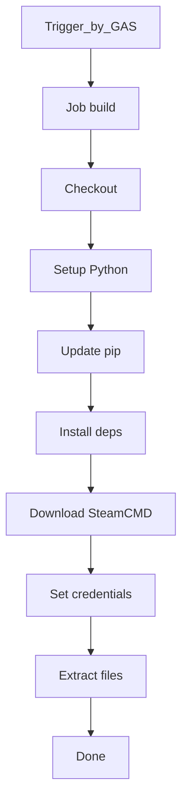
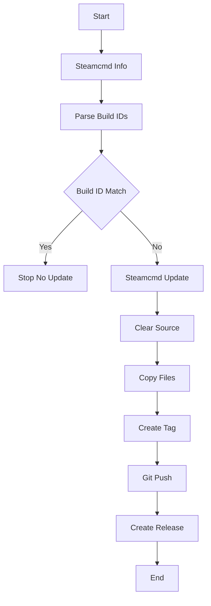

## 機能概要

EU5はSteamcmdを通して4時間毎に更新があるかチェックされます。更新がある場合にはgithub actionsから利用できるwindows VMにインストールされ、その中にあるlocalization関係のファイルがgitに取り込まれます。またゲームバージョンを含んだ２つのテキストファイルを読み取りリリースタグを作ります。

## 処理フロー

Extract filesの処理は以下

