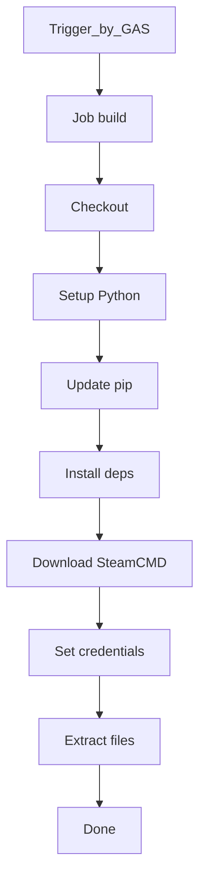
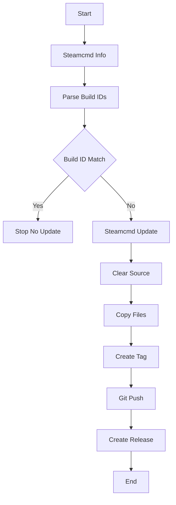

## 機能概要

### 機能１
本スクリプトはEU5をSteamcmdを通して4時間毎に更新があるかチェックします。更新がある場合にはgithub actionsから利用できるwindows VMにインストールされ、その中にあるlocalization関係のファイルがgitに取り込まれます。対象は以下です。

- clausewitz\loading_screen\localization
- jomini\loading_screen\localization
- game\main_menu\localization\english
- game\main_menu\localization\japanese
- game\main_menu\localization\jomini
- game\main_menu\localization\music_player_gui
- game\loading_screen\localization

またゲームバージョンを含んだ以下２つのテキストファイルを読み取りリリースタグを作ります。

- caesar_branch.txt
- clausewitz_branch.txt

以下のファイルは使っていませんが念のために取り込んでいます。

- caesar_rev.txt
- clausewitz_rev.txt

### 機能２
最新のタグと１つ前のタグのファイル差分を比較し、追加がある項目のみを残したファイルをそのままのディレクトリ構造でzip化したdiff_output.zipを最新リリースに貼り付けます。

## 処理フロー

Extract filesの処理は以下

